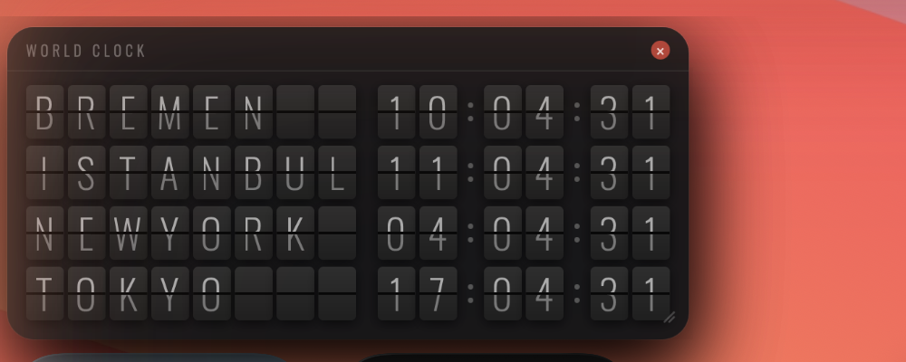

# ✈️ Split-Flap World Clock

A macOS desktop widget for [Übersicht](https://tracesof.net/uebersicht/) that displays a real-time world clock in the style of classic airport departure boards — complete with authentic split-flap flip animations.



---

## Features

- 🕐 **Real-time clocks** for 4 cities: your local city, Istanbul, New York, and Tokyo
- 🔤 **Full split-flap animation** — every character (city names and digits) flips individually with a 3D card effect
- 🌍 **Auto-detects your city** via IP geolocation (no permissions required)
- 🎲 **Scramble animation** every 10 minutes — city names shuffle through random characters before settling, just like a real departures board
- 🖱️ **Draggable** — move the widget anywhere on your desktop
- 🔲 **Resizable** — drag the bottom-right corner to scale up or down (0.5× – 2.5×)
- ✕ **One-click close** — macOS-style red close button
- 💾 **Persistent** — position and size are saved across restarts
- 🎨 **macOS widget aesthetic** — dark glass background, blur backdrop, rounded corners

---

## Preview

```
┌─────────────────────────────────────────────────┐
│ WORLD CLOCK                                   × │
│                                                  │
│  B R E M E N _ _    0 9 : 5 2 : 3 1            │
│  I S T A N B U L    1 0 : 5 2 : 3 1            │
│  N E W Y O R K _    0 3 : 5 2 : 3 1            │
│  T O K Y O _ _ _    1 6 : 5 2 : 3 1            │
└─────────────────────────────────────────────────┘
```

---

## Requirements

- macOS 12 or later
- [Übersicht](https://tracesof.net/uebersicht/) — free desktop widget app

---

## Installation

1. **Install Übersicht**
   Download from [tracesof.net/uebersicht](https://tracesof.net/uebersicht/) and open it.

2. **Download the widget**
   Clone this repo or download `split-flap-clock.jsx` directly:
   ```bash
   git clone https://github.com/yourusername/split-flap-world-clock.git
   ```

3. **Place the widget**
   Copy `split-flap-clock.jsx` into your Übersicht widgets folder:
   ```bash
   cp split-flap-clock.jsx ~/Library/Application\ Support/Übersicht/widgets/
   ```
   Or open the folder directly from the Übersicht menu bar → **Open Widgets Folder**.

4. **Grant Accessibility permission**
   Go to **System Settings → Privacy & Security → Accessibility** and enable Übersicht.

That's it — the widget will appear on your desktop automatically.

---

## Customization

Open `split-flap-clock.jsx` in any text editor.

### Change cities

Edit the `CITIES` array near the top of the file:

```js
const CITIES = [
  { id: 'local',    label: null,         tz: null                 }, // auto-detected
  { id: 'istanbul', label: 'ISTANBUL',   tz: 'Europe/Istanbul'    },
  { id: 'newyork',  label: 'NEWYORK',    tz: 'America/New_York'   },
  { id: 'tokyo',    label: 'TOKYO',      tz: 'Asia/Tokyo'         },
];
```

Use any [IANA timezone string](https://en.wikipedia.org/wiki/List_of_tz_database_time_zones) for `tz`.

### Override local city name

If auto-detection shows the wrong city, set it manually:

```js
const CITY_OVERRIDE = 'BREMEN'; // set to null to use auto-detection
```

### Adjust scramble frequency

Change how often the scramble animation fires (default: every 10 minutes):

```js
// 600 = every 10 minutes, 3600 = every hour
const isScrambling = () => (Math.floor(Date.now() / 1000) % 600) < SCRAMBLE_SECS;
```

### Adjust card size

```js
const W = 28, H = 40, FS = 30; // width, height, font-size (px)
```

---

## How It Works

Each character — both city name letters and time digits — is rendered as an individual split-flap card. The card is split horizontally into two halves:

- **Top half** shows the upper portion of the character
- **Bottom half** shows the lower portion

When a character changes, a CSS 3D `rotateX` animation flips the top half away, revealing the new character underneath — exactly like a mechanical Solari board.

City names are auto-detected using [freeipapi.com](https://freeipapi.com), with fallbacks to [ipinfo.io](https://ipinfo.io) and [ip-api.com](https://ip-api.com). The result is cached for 1 hour.

---

## Resetting the Widget

- **Reopen after closing:** Übersicht menu bar → **Reload All Widgets**
- **Reset position/size:** Übersicht menu bar → **Reload All Widgets** (clears localStorage on restart)

---

## License

MIT — free to use, modify, and share.

---

Made with ☕ and too many airport layovers.
